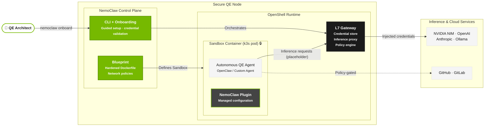

# NVIDIA NemoClaw: Building a Hardened Runtime for Autonomous QE Agents

## Executive Summary

As we transition from traditional automated testing to **Autonomous Quality Engineering**, the security and isolation of our AI agents become paramount. **NVIDIA NemoClaw** is a professional-grade, opinionated reference stack built on **NVIDIA OpenShell**. It provides a secure, sandboxed environment for agents like OpenClaw, ensuring that test execution, inference calls, and data access are strictly governed by policy.

In this guide, we explore how to build and deploy NemoClaw to serve as the "hardened host" for our QE intelligence.

---

## Architectural Deep Dive

NemoClaw operates by orchestrating a secure gateway and a sandboxed container for the agent. The architecture uses a layered approach to security, leveraging **Docker**, **embedded k3s**, and **L7 Proxying** for credential injection.

### Logical Architecture



---

## Prerequisites

To build and run NemoClaw, your environment must meet the following specifications:

- **OS**: Windows (WSL2), Linux, or macOS.
- **Node.js**: v22.0.0 or higher (required for the CLI and plugin).
- **Docker**: Desktop or Engine (v24+ recommended).
- **Memory**: Minimum 8GB RAM (16GB recommended for LLM orchestration).
- **Hardware Acceleration**: NVIDIA GPU recommended for local NIM inference, though cloud endpoints are supported.

---

## Build & Installation Steps

### 1. Source Acquisition
Clone the NemoClaw repository from the NVIDIA organization:

```bash
git clone https://github.com/NVIDIA/NemoClaw.git
cd NemoClaw
```

### 2. Dependency Installation
Install the TypeScript dependencies for the CLI and Plugin:

```bash
npm install
```

### 3. Building the CLI
Transpile the TypeScript source to the distribution folder:

```bash
npm run build
```

### 4. Interactive Onboarding
NemoClaw provides a guided wizard to configure your first sandbox, inference providers, and security policies:

```bash
# Link the local build to your path
npm link

# Start the onboarding process
nemoclaw onboard
```

---

## Security Posture: The "Claw" Principle

NemoClaw implements the "Claw" principle for AI security:

1.  **Credential Isolation**: The agent inside the sandbox *never* sees the raw API keys. The L7 Proxy intercepts requests and injects keys at the network boundary.
2.  **Filesystem Guardrails**: Access is restricted using **Landlock** (on Linux) and standard container isolation, limiting the agent to `/sandbox` and `/tmp`.
3.  **Network Policies**: All egress is blocked by default except for the configured inference endpoints and whitelisted developer tools (e.g., GitHub).

---

## Observability & Enterprise Scalability

For production-grade QE environments, NemoClaw should be extended with the following patterns:

### 1. Distributed Tracing (OpenTelemetry)
To monitor the latency of autonomous agents, integrate OpenTelemetry spans at the Gateway level. This allows you to differentiate between agent "thinking" time and inference provider response time.

### 2. High Availability (HA)
In large-scale testing cycles, deploy a cluster of OpenShell Gateways behind an L7 Load Balancer. Use an external secrets manager (like **Azure Key Vault** or **GCP Secret Manager**) as the backing store for the gateway's credential provider.

### 3. Stateful Migration
Leverage NemoClaw's **Snapshot/Restore** feature to move long-running QE agents between nodes (e.g., from local workstations to cloud-based Spot instances) without losing the agent's conversation or filesystem state.

---

## QE Integration: The Autonomous Gatekeeper

In our **AI-Powered QE** stack, NemoClaw acts as the execution layer for autonomous agents that:

-   **Analyze Codebases**: Safely clones and reads code without risking host machine compromise.
-   **Execute Tests**: Runs test suites in a clean, ephemeral environment.
-   **Report Defects**: Communicates with Jira/GitHub via the secure gateway.

By hosting our QE intelligence in NemoClaw, we ensure that our "Principal Architect" grade solutions are not only smart but enterprise-hardened.
